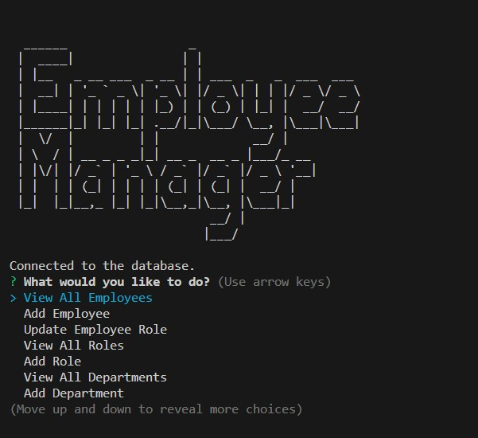

# Employee Tracker

## Description

The Employee Tracker is a command-line application that allows business owners to view and manage their company's departments, roles, and employees. Built using Node.js, Inquirer, and MySQL, it provides an intuitive interface for organizing and planning a business.

The walkthrough video can be accessed [here](https://drive.google.com/file/d/1Z895YpVYSbGV_r40-u5IQ223YPREHz_-/view?usp=sharing).



## Table of Contents

- [Installation](#installation)
- [Usage](#usage)

## Installation

To install the necessary dependencies, you'll first need to clone the repository. Navigate to the directory where you've cloned it and run the following command:

```
npm install
```

This project requires two npm packages:

1. `inquirer` - This will prompt the user for inputs from the command line.
2. `mysql2` - This will enable interaction with the MySQL database.

To install these packages, use the following commands:

```
npm install inquirer
npm install mysql2
```

After installing the dependencies, you'll need to set up the database. Navigate to the MySQL shell and execute the commands found in the `schema.sql` file, followed by the `seeds.sql` file.

## Usage

After installation, run the application using:

\```
npm start
\```

Follow the on-screen prompts to manage the employee database.

1. **Starting the Application**: 
   - Navigate to the root directory of the project in your terminal.
   - Run the following command to start the application:
     ```
     npm start
     ```

2. **Main Menu**: 
   - Once the application starts, you'll be presented with a main menu listing various actions you can perform, such as:
     - View all departments
     - View all roles
     - View all employees
     - Add a department
     - Add a role
     - Add an employee
     - Update an employee role
     - ... and more!

3. **Viewing Data**: 
   - Choose any of the "View" options to display data in tabular form.
   - For instance, selecting "View All Employees" will show you a table with employee details, including their names, roles, departments, salaries, and managers.

4. **Adding Data**: 
   - For options like "Add a department", "Add a role", or "Add an employee", you'll be prompted to enter the necessary information. 
   - Fill in the required details, and the new data will be added to the database.

5. **Updating Data**:
   - When choosing to update an employee's role, you'll first select the employee and then choose the new role from a list.

6. **Additional Features**:
   - The application also offers features like viewing employees by manager or department, updating employee managers, and viewing the utilized budget of a department.

7. **Exiting the Application**:
   - Navigate to the "Exit" option in the main menu to close the application.